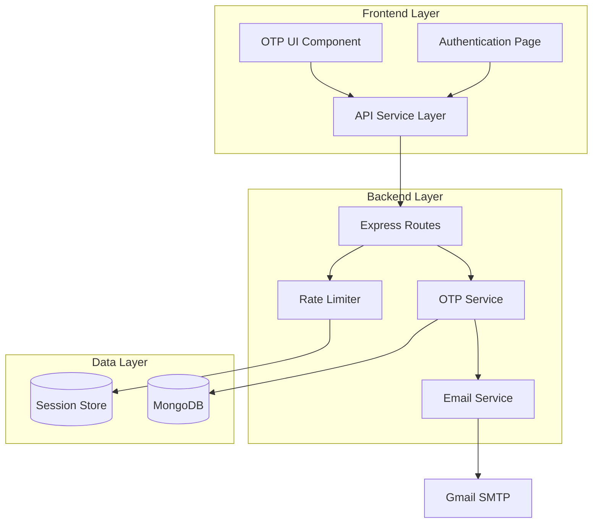

# Design Document: Email OTP Verification

## Overview

This design document specifies the technical implementation for adding email-based One-Time Password (OTP) verification to the document verification application. The feature integrates with the existing Node.js/Express backend and React/TypeScript frontend to provide secure identity verification through time-limited OTP codes sent via Gmail SMTP.

The system will generate cryptographically random 6-digit OTP codes, deliver them via email, validate user submissions, and enforce rate limiting to prevent abuse. The implementation leverages the existing MongoDB database and Express session infrastructure while adding new API endpoints, database models, and UI components.

## Architecture

### High-Level Architecture

The OTP verification system follows a client-server architecture with three primary layers:



### Component Interaction Flow

1. **OTP Generation Flow**:
   - User initiates document verification
   - Frontend calls `/api/otp/generate` endpoint
   - Rate limiter checks generation attempts (3 per 15 min)
   - OTP Service generates 6-digit code
   - Email Service sends code via Gmail SMTP
   - OTP stored in MongoDB with expiration timestamp

2. **OTP Validation Flow**:
   - User enters OTP code in UI
   - Frontend calls `/api/otp/validate` endpoint
   - Rate limiter checks validation attempts (5 per session)
   - OTP Service validates code against database
   - On success, marks code as used and proceeds to document verification
   - On failure, returns specific error message

### Integration Points

- **Existing Authentication**: Integrates with current Express session middleware
- **MongoDB**: Uses existing mongoose connection, adds new OTP collection
- **Frontend**: Extends AuthenticationPage component with OTP verification step
- **API Layer**: Adds new endpoints to existing Express router structure

## Components and Interfaces

### Backend Components

#### 1. OTP Service (`services/otpService.js`)

Responsible for OTP lifecycle management including generation, storage, validation, and cleanup.

**Interface**:
```javascript
class OTPService {
  /**
   * Generate a new OTP code for the given email
   * @param {string} email - User's email address
   * @returns {Promise<{otp: string, expiresAt: Date}>}
   * @throws {Error} If generation fails
   */
  async generateOTP(email)
  
  /**
   * Validate an OTP code
   * @param {string} email - User's email address
   * @param {string} otp - OTP code to validate
   * @returns {Promise<{valid: boolean, error?: string}>}
   */
  async validateOTP(email, otp)
  
  /**
   * Invalidate all existing OTPs for an email
   * @param {string} email - User's email address
   * @returns {Promise<void>}
   */
  async invalidateOTPs(email)
  
  /**
   * Clean up expired OTP records
   * @returns {Promise<number>} Number of records deleted
   */
  async cleanupExpiredOTPs()
}
```

**Key Responsibilities**:
- Generate cryptographically random 6-digit codes using `crypto.randomInt()`
- Store OTP with email, creation time, expiration time (10 minutes), and validation status
- Validate OTP against stored value and expiration
- Invalidate previous OTPs when generating new ones
- Track validation attempts per OTP record

#### 2. Email Service (`services/emailService.js`)

Handles email delivery via Gmail SMTP with proper error handling and retry logic.

**Interface**:
```javascript
class EmailService {
  /**
   * Initialize email service with SMTP configuration
   * @throws {Error} If SMTP configuration is invalid
   */
  constructor()
  
  /**
   * Send OTP email to user
   * @param {string} email - Recipient email address
   * @param {string} otp - OTP code to send
   * @param {Date} expiresAt - Expiration timestamp
   * @returns {Promise<{success: boolean, messageId?: string}>}
   */
  async sendOTPEmail(email, otp, expiresAt)
  
  /**
   * Verify SMTP configuration on startup
   * @returns {Promise<boolean>}
   */
  async verifyConfiguration()
}
```

**Key Responsibilities**:
- Configure nodemailer with Gmail SMTP settings from environment variables
- Format OTP emails with clear subject and body
- Include security warnings in email content
- Handle email delivery failures gracefully
- Verify SMTP configuration on application startup

#### 3. Rate Limiter Middleware (`middleware/rateLimiter.js`)

Prevents abuse by limiting OTP generation and validation attempts.

**Interface**:
```javascript
/**
 * Rate limit OTP generation requests
 * Limit: 3 attempts per 15 minutes per user
 */
function rateLimitGeneration(req, res, next)

/**
 * Rate limit OTP validation requests
 * Limit: 5 attempts per session
 */
function rateLimitValidation(req, res, next)

/**
 * Check if session is locked due to too many attempts
 */
function checkSessionLock(req, res, next)
```

**Key Responsibilities**:
- Track generation attempts per email in session
- Track validation attempts per session
- Implement 15-minute lockout for exceeded limits
- Store attempt counts and timestamps in Express session
- Return appropriate error messages when limits exceeded

#### 4. API Routes (`routes/otpRoutes.js`)

Express routes for OTP operations.

**Endpoints**:

```javascript
// Generate and send OTP
POST /api/otp/generate
Body: { email: string }
Response: { message: string, expiresAt: Date }

// Validate OTP
POST /api/otp/validate
Body: { email: string, otp: string }
Response: { valid: boolean, message: string }

// Resend OTP (with 60-second cooldown)
POST /api/otp/resend
Body: { email: string }
Response: { message: string, expiresAt: Date }
```

### Frontend Components

#### 1. OTP Verification Component (`components/auth/OTPVerification.tsx`)

React component for OTP input and validation UI.

**Interface**:
```typescript
interface OTPVerificationProps {
  email: string;
  onSuccess: () => void;
  onCancel: () => void;
}

const OTPVerification: React.FC<OTPVerificationProps>
```

**Key Features**:
- 6-digit OTP input field with auto-focus
- Countdown timer showing remaining validity time
- Resend button (enabled after 60 seconds)
- Error message display
- Loading states during API calls
- Masked email display for privacy

#### 2. Enhanced Authentication Page

Extends existing `AuthenticationPage.tsx` to include OTP verification step.

**Flow Integration**:
1. User completes signup/signin
2. System triggers OTP verification step
3. OTP component displays
4. On successful validation, proceeds to document verification
5. On failure, shows error and allows retry

#### 3. API Service Extension (`services/api.ts`)

Add OTP-related API methods to existing service layer.

**New Methods**:
```typescript
export const otpService = {
  async generateOTP(email: string): Promise<{message: string, expiresAt: string}>
  async validateOTP(email: string, otp: string): Promise<{valid: boolean, message: string}>
  async resendOTP(email: string): Promise<{message: string, expiresAt: string}>
}
```

## Data Models

### OTP Collection Schema

```javascript
const otpSchema = new mongoose.Schema({
  email: {
    type: String,
    required: true,
    index: true
  },
  otp: {
    type: String,
    required: true
  },
  createdAt: {
    type: Date,
    default: Date.now,
    index: true
  },
  expiresAt: {
    type: Date,
    required: true,
    index: true
  },
  validated: {
    type: Boolean,
    default: false
  },
  validationAttempts: {
    type: Number,
    default: 0
  },
  validatedAt: {
    type: Date
  }
});

// TTL index for automatic cleanup (24 hours after expiration)
otpSchema.index({ expiresAt: 1 }, { expireAfterSeconds: 86400 });
```

**Indexes**:
- `email`: For fast lookup during validation
- `createdAt`: For cleanup queries
- `expiresAt`: TTL index for automatic document deletion

### Session Data Extensions

Extend Express session to track rate limiting:

```typescript
interface SessionData {
  userId?: string;
  otpGeneration?: {
    attempts: number;
    firstAttempt: Date;
    lockedUntil?: Date;
  };
  otpValidation?: {
    attempts: number;
    lockedUntil?: Date;
  };
}
```

### Environment Variables

New environment variables required:

```bash
# Gmail SMTP Configuration
EMAIL_USER=your-email@gmail.com
EMAIL_PASS=your-app-password

# OTP Configuration (optional, with defaults)
OTP_EXPIRY_MINUTES=10
OTP_GENERATION_LIMIT=3
OTP_GENERATION_WINDOW_MINUTES=15
OTP_VALIDATION_LIMIT=5
OTP_RESEND_COOLDOWN_SECONDS=60
```


## Correctness Properties

*A property is a characteristic or behavior that should hold true across all valid executions of a system—essentially, a formal statement about what the system should do. Properties serve as the bridge between human-readable specifications and machine-verifiable correctness guarantees.*

After analyzing all acceptance criteria, I've identified the following properties that can be validated through property-based testing. Properties marked as redundant have been consolidated to avoid duplicate testing.

### Property 1: OTP Format Validity

*For any* user email, when an OTP is generated, the resulting code SHALL be exactly 6 digits and contain only numeric characters (0-9).

**Validates: Requirements 1.1**

### Property 2: OTP-Email Association

*For any* user email, after generating an OTP, retrieving the OTP using that email SHALL return the same code that was generated.

**Validates: Requirements 1.3**

### Property 3: OTP Expiration Time

*For any* generated OTP, the expiration timestamp SHALL be exactly 10 minutes (600 seconds) after the creation timestamp.

**Validates: Requirements 1.4**

### Property 4: OTP Invalidation on Regeneration

*For any* user email, when two OTPs are generated sequentially, only the second OTP SHALL be valid for validation, and the first SHALL be invalidated.

**Validates: Requirements 1.5**

### Property 5: Email Subject Format

*For any* OTP email sent, the subject line SHALL contain the text "Document Verification OTP".

**Validates: Requirements 2.2**

### Property 6: Email Content Completeness

*For any* OTP email sent, the email body SHALL contain the OTP code, expiration time information, and a security warning.

**Validates: Requirements 2.3**

### Property 7: OTP Validation Correctness

*For any* email and OTP pair, validation SHALL return success if and only if the OTP matches the stored value for that email, the OTP has not expired, and the OTP has not been previously validated.

**Validates: Requirements 3.1, 3.4**

### Property 8: Expired OTP Rejection

*For any* OTP that has passed its expiration timestamp, validation SHALL fail and return an error indicating expiration.

**Validates: Requirements 3.2**

### Property 9: Incorrect OTP Rejection

*For any* email with a valid unexpired OTP, submitting an incorrect OTP code SHALL fail validation and return an error indicating invalid code.

**Validates: Requirements 3.3**

### Property 10: OTP Single-Use Enforcement

*For any* valid OTP, after successful validation, subsequent validation attempts with the same OTP SHALL fail.

**Validates: Requirements 3.5**

### Property 11: Generation Rate Limiting

*For any* user email, making more than 3 OTP generation requests within a 15-minute window SHALL result in the 4th and subsequent requests being rejected until the window expires.

**Validates: Requirements 4.1**

### Property 12: Validation Rate Limiting

*For any* verification session, making more than 5 incorrect validation attempts SHALL result in subsequent validation attempts being rejected.

**Validates: Requirements 4.2**

### Property 13: Session Lockout Duration

*For any* session that exceeds validation attempt limits, validation attempts SHALL be rejected for exactly 15 minutes from the time the limit was exceeded.

**Validates: Requirements 4.3**

### Property 14: Audit Logging Completeness

*For any* OTP generation or validation operation, a log entry SHALL be created containing a timestamp and user identifier (email).

**Validates: Requirements 4.4**

### Property 15: Lockout Error Message

*For any* validation attempt on a locked session, the error response SHALL indicate "too many attempts" with the remaining lockout time.

**Validates: Requirements 4.5**

### Property 16: Email Masking Display

*For any* email address displayed in confirmation messages, the email SHALL be masked (showing only first character and domain) to protect privacy.

**Validates: Requirements 5.3**

### Property 17: Countdown Timer Accuracy

*For any* active OTP verification session, the displayed remaining time SHALL decrease at 1 second intervals and match the difference between current time and expiration time.

**Validates: Requirements 5.5**

### Property 18: Resend Button Availability

*For any* OTP verification session, the resend button SHALL be disabled for the first 60 seconds after OTP generation, then become enabled.

**Validates: Requirements 5.6**

### Property 19: Error Message Propagation

*For any* failed OTP validation, the error message displayed in the UI SHALL exactly match the error message returned by the OTP service.

**Validates: Requirements 5.7**

### Property 20: Sender Email Consistency

*For any* OTP email sent by the system, the sender address SHALL match the configured EMAIL_USER environment variable.

**Validates: Requirements 6.5**

### Property 21: Expired Record Cleanup

*For any* OTP records with expiration timestamps older than 24 hours, running the cleanup process SHALL remove those records from the database.

**Validates: Requirements 7.3**

### Property 22: OTP Record Completeness

*For any* OTP record stored in the database, it SHALL contain all required fields: code value, user email, creation timestamp, expiration timestamp, validation status, and attempt count.

**Validates: Requirements 7.4**

## Error Handling

### Error Categories

The system handles four primary categories of errors:

1. **Validation Errors**: Invalid input data (malformed email, non-numeric OTP)
2. **Business Logic Errors**: Expired OTP, incorrect OTP, rate limit exceeded
3. **Infrastructure Errors**: Email delivery failure, database connection issues
4. **Configuration Errors**: Missing or invalid SMTP credentials

### Error Response Format

All API endpoints return consistent error responses:

```javascript
{
  success: false,
  error: {
    code: "ERROR_CODE",
    message: "Human-readable error message",
    details: {} // Optional additional context
  }
}
```

### Error Codes

```javascript
// Validation Errors (400)
INVALID_EMAIL: "Email address is invalid or missing"
INVALID_OTP_FORMAT: "OTP must be 6 digits"
MISSING_REQUIRED_FIELD: "Required field is missing"

// Business Logic Errors (400/429)
OTP_EXPIRED: "OTP code has expired. Please request a new code"
OTP_INVALID: "Invalid OTP code. Please try again"
OTP_ALREADY_USED: "This OTP has already been used"
RATE_LIMIT_GENERATION: "Too many OTP requests. Please try again in X minutes"
RATE_LIMIT_VALIDATION: "Too many validation attempts. Please try again in X minutes"
SESSION_LOCKED: "Account temporarily locked due to too many attempts"

// Infrastructure Errors (500/503)
EMAIL_DELIVERY_FAILED: "Failed to send OTP. Please check your email address and try again"
DATABASE_ERROR: "Database operation failed. Please try again"
SMTP_CONFIG_ERROR: "Email service is not configured properly"

// Configuration Errors (500)
SMTP_NOT_CONFIGURED: "Email service is not available"
INVALID_SMTP_CREDENTIALS: "Email service authentication failed"
```

### Error Handling Strategies

#### Backend Error Handling

1. **Input Validation**: Validate all inputs before processing
   ```javascript
   if (!email || !isValidEmail(email)) {
     throw new ValidationError('INVALID_EMAIL');
   }
   ```

2. **Database Errors**: Wrap database operations in try-catch
   ```javascript
   try {
     await OTP.findOne({ email });
   } catch (error) {
     logger.error('Database query failed', { error, email });
     throw new InfrastructureError('DATABASE_ERROR');
   }
   ```

3. **Email Delivery**: Handle SMTP failures gracefully
   ```javascript
   try {
     await transporter.sendMail(mailOptions);
   } catch (error) {
     logger.error('Email delivery failed', { error, email });
     throw new InfrastructureError('EMAIL_DELIVERY_FAILED');
   }
   ```

4. **Rate Limiting**: Check limits before processing
   ```javascript
   if (isRateLimited(req.session)) {
     throw new RateLimitError('RATE_LIMIT_GENERATION', remainingTime);
   }
   ```

#### Frontend Error Handling

1. **Network Errors**: Retry with exponential backoff (using existing `withNetworkRetry`)
2. **Display Errors**: Show user-friendly messages from error responses
3. **Validation Errors**: Provide inline validation feedback
4. **Timeout Handling**: Show timeout message after 30 seconds

### Logging Strategy

All errors are logged with structured data:

```javascript
logger.error('OTP validation failed', {
  email: maskEmail(email),
  errorCode: 'OTP_INVALID',
  attemptCount: session.otpValidation.attempts,
  timestamp: new Date().toISOString(),
  sessionId: req.sessionID
});
```

**Log Levels**:
- `ERROR`: All validation failures, rate limit hits, email delivery failures
- `WARN`: Configuration issues, approaching rate limits
- `INFO`: Successful OTP generation and validation
- `DEBUG`: Detailed operation flow (development only)

### Recovery Mechanisms

1. **Email Delivery Failure**: Allow user to retry or use alternative email
2. **Rate Limit Hit**: Display countdown timer and allow retry after cooldown
3. **Expired OTP**: Provide clear "Request New Code" button
4. **Database Connection Loss**: Retry with exponential backoff, fail gracefully after 3 attempts

## Testing Strategy

### Dual Testing Approach

The testing strategy employs both unit tests and property-based tests to ensure comprehensive coverage:

- **Unit Tests**: Verify specific examples, edge cases, error conditions, and integration points
- **Property-Based Tests**: Verify universal properties across randomized inputs (minimum 100 iterations per test)

Both approaches are complementary and necessary. Unit tests catch concrete bugs in specific scenarios, while property-based tests verify general correctness across a wide input space.

### Property-Based Testing Configuration

**Library**: `fast-check` (already in devDependencies)

**Configuration**:
```javascript
import fc from 'fast-check';

// Minimum 100 iterations per property test
const testConfig = { numRuns: 100 };

// Each test must reference its design property
// Tag format: Feature: email-otp-verification, Property {number}: {property_text}
```

**Example Property Test**:
```javascript
describe('Feature: email-otp-verification, Property 1: OTP Format Validity', () => {
  it('generates 6-digit numeric OTPs for any email', async () => {
    await fc.assert(
      fc.asyncProperty(
        fc.emailAddress(),
        async (email) => {
          const { otp } = await otpService.generateOTP(email);
          expect(otp).toMatch(/^\d{6}$/);
        }
      ),
      { numRuns: 100 }
    );
  });
});
```

### Unit Testing Strategy

**Framework**: Jest (already configured)

**Test Organization**:
```
tests/
├── unit/
│   ├── services/
│   │   ├── otpService.test.js
│   │   └── emailService.test.js
│   ├── middleware/
│   │   └── rateLimiter.test.js
│   └── routes/
│       └── otpRoutes.test.js
├── integration/
│   └── otpFlow.test.js
└── property/
    ├── otpGeneration.property.test.js
    ├── otpValidation.property.test.js
    └── rateLimiting.property.test.js
```

**Unit Test Focus Areas**:

1. **OTP Service**:
   - Specific example: Generate OTP for "test@example.com"
   - Edge case: Handle empty email string
   - Edge case: Handle very long email addresses
   - Error condition: Database connection failure
   - Error condition: Invalid email format

2. **Email Service**:
   - Specific example: Send OTP email with valid SMTP config
   - Edge case: Handle special characters in email addresses
   - Error condition: SMTP authentication failure
   - Error condition: Network timeout

3. **Rate Limiter**:
   - Specific example: Allow 3 generation attempts
   - Specific example: Block 4th generation attempt
   - Edge case: Session expiration during rate limit
   - Error condition: Missing session data

4. **Integration Tests**:
   - Complete OTP flow: generate → send → validate
   - Resend flow: generate → resend → validate
   - Rate limit flow: exceed limit → wait → retry
   - Error recovery: email failure → retry → success

### Property-Based Test Coverage

Each correctness property from the design document must have a corresponding property-based test:

**Property 1-6**: OTP Generation Properties
- Test with random email addresses
- Test with random timestamps
- Verify format, association, expiration, invalidation

**Property 7-10**: OTP Validation Properties
- Test with random valid/invalid OTP codes
- Test with random expiration times
- Verify correctness, rejection, single-use

**Property 11-15**: Rate Limiting Properties
- Test with random attempt counts
- Test with random time windows
- Verify limits, lockouts, error messages

**Property 16-22**: UI and Storage Properties
- Test with random email formats for masking
- Test with random timestamps for countdown
- Verify display, cleanup, record completeness

### Test Data Generators

Custom generators for property-based tests:

```javascript
// Email generator
const emailArb = fc.emailAddress();

// OTP generator (6 digits)
const otpArb = fc.integer({ min: 100000, max: 999999 }).map(n => n.toString());

// Timestamp generator (within reasonable range)
const timestampArb = fc.date({ min: new Date('2024-01-01'), max: new Date('2025-12-31') });

// Session data generator
const sessionArb = fc.record({
  userId: fc.uuid(),
  otpGeneration: fc.record({
    attempts: fc.integer({ min: 0, max: 10 }),
    firstAttempt: timestampArb
  })
});
```

### Mocking Strategy

**Email Service**: Mock nodemailer transporter in tests
```javascript
jest.mock('nodemailer');
const mockSendMail = jest.fn();
nodemailer.createTransport.mockReturnValue({ sendMail: mockSendMail });
```

**Database**: Use in-memory MongoDB for integration tests
```javascript
const { MongoMemoryServer } = require('mongodb-memory-server');
let mongoServer;

beforeAll(async () => {
  mongoServer = await MongoMemoryServer.create();
  await mongoose.connect(mongoServer.getUri());
});
```

**Time**: Mock Date.now() for expiration testing
```javascript
jest.useFakeTimers();
jest.setSystemTime(new Date('2024-01-01T00:00:00Z'));
```

### Test Coverage Goals

- **Line Coverage**: Minimum 85%
- **Branch Coverage**: Minimum 80%
- **Function Coverage**: Minimum 90%
- **Property Test Iterations**: Minimum 100 per test

### Continuous Integration

Tests run automatically on:
- Every commit (unit tests only)
- Pull requests (full test suite)
- Pre-deployment (full test suite + integration tests)

**CI Configuration** (GitHub Actions example):
```yaml
- name: Run Unit Tests
  run: npm test -- --coverage
  
- name: Run Property Tests
  run: npm test -- --testPathPattern=property
  
- name: Check Coverage
  run: npm run test:coverage -- --coverageThreshold='{"global":{"lines":85,"branches":80,"functions":90}}'
```

## Implementation Notes

### Security Considerations

1. **OTP Storage**: Store OTPs in plain text (they're single-use and short-lived)
2. **Rate Limiting**: Implement at both application and session level
3. **Email Masking**: Always mask emails in logs and UI (e.g., "t***@example.com")
4. **SMTP Credentials**: Never log or expose EMAIL_PASS in responses
5. **Session Security**: Use secure cookies in production (already configured)

### Performance Considerations

1. **Database Indexes**: Create indexes on `email` and `expiresAt` fields
2. **TTL Index**: Use MongoDB TTL index for automatic cleanup (reduces manual cleanup load)
3. **Email Sending**: Send emails asynchronously (don't block API response)
4. **Cleanup Job**: Run cleanup every 6 hours via cron job or scheduled task

### Scalability Considerations

1. **Stateless Design**: All rate limiting data in session store (supports horizontal scaling)
2. **Database Connection Pooling**: Use mongoose default connection pool
3. **Email Queue**: For high volume, consider adding email queue (e.g., Bull with Redis)
4. **Caching**: Cache SMTP configuration validation result

### Migration Path

Since the application already has basic OTP functionality in `server.js`, the migration involves:

1. **Phase 1**: Extract existing OTP code into `otpService.js`
2. **Phase 2**: Add rate limiting middleware
3. **Phase 3**: Enhance email service with proper error handling
4. **Phase 4**: Update frontend with new OTP component
5. **Phase 5**: Add comprehensive tests
6. **Phase 6**: Deploy with feature flag (optional)

### Backward Compatibility

The existing OTP endpoints (`/api/auth/send-email-otp` and `/api/auth/verify-email-otp`) will be deprecated but maintained for 2 release cycles. New endpoints will be:
- `/api/otp/generate`
- `/api/otp/validate`
- `/api/otp/resend`

### Monitoring and Observability

**Metrics to Track**:
- OTP generation rate (per minute)
- OTP validation success rate
- Email delivery success rate
- Average validation time
- Rate limit hit frequency
- Session lockout frequency

**Alerts**:
- Email delivery failure rate > 5%
- OTP validation failure rate > 30%
- Rate limit hits > 100/hour
- SMTP authentication failures

### Documentation Requirements

1. **API Documentation**: Update API docs with new endpoints
2. **Environment Variables**: Document all EMAIL_* variables
3. **User Guide**: Add OTP verification flow to user documentation
4. **Admin Guide**: Document rate limit configuration and monitoring
5. **Troubleshooting**: Common issues and solutions (SMTP config, rate limits)

## Deployment Checklist

- [ ] Environment variables configured (EMAIL_USER, EMAIL_PASS)
- [ ] Gmail App Password generated and tested
- [ ] MongoDB indexes created
- [ ] SMTP configuration validated on startup
- [ ] Rate limiting tested in staging
- [ ] Email templates reviewed and approved
- [ ] Error messages reviewed for clarity
- [ ] Monitoring dashboards configured
- [ ] Alerts configured
- [ ] Documentation updated
- [ ] Rollback plan prepared
- [ ] Feature flag configured (if using phased rollout)

