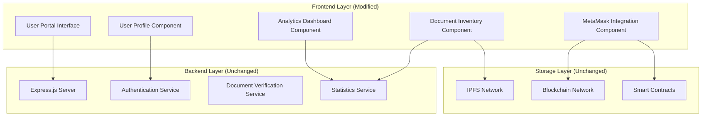
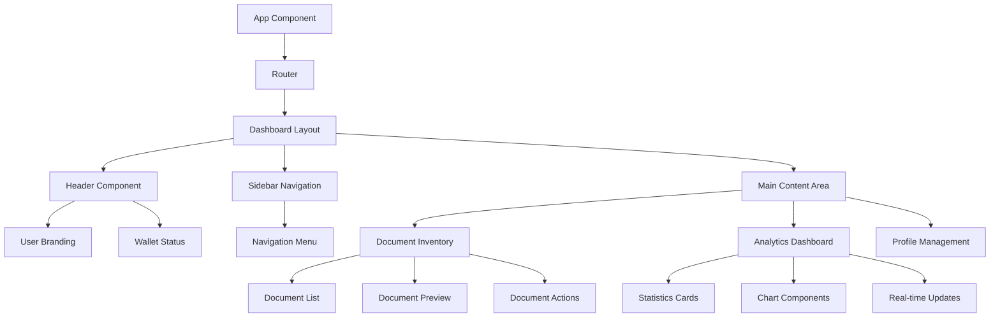

# Design Document: User Portal Redesign

## Overview

The User Portal Redesign transforms the existing Document Verification System frontend from a generic verification platform into a personalized user-centric dashboard. This redesign focuses exclusively on frontend modifications while preserving all existing backend functionality, blockchain integration, and IPFS storage mechanisms.

The new design implements a modern dashboard interface centered around a comprehensive document inventory system with real-time analytics. The portal provides users with a personalized experience featuring their name as primary branding, intuitive document management capabilities, and visual analytics of their document portfolio.

Key design principles include maintaining complete backend compatibility, implementing responsive design patterns, and creating an intuitive user experience that transforms complex document verification workflows into accessible dashboard interactions.

## Architecture

### High-Level Architecture

The redesigned system maintains the existing three-tier architecture while focusing modifications exclusively on the presentation layer:



### Component Architecture

The frontend architecture follows a modular component-based design using React patterns:



### Data Flow Architecture

The system maintains existing API communication patterns while introducing new frontend state management:

1. **Authentication Flow**: Preserves existing MetaMask and traditional auth patterns
2. **Document Retrieval**: Maintains IPFS hash-based document fetching
3. **Statistics Updates**: Implements real-time polling of `/api/stats` endpoint
4. **State Management**: Uses React Context for global state management
5. **Component Communication**: Implements event-driven updates for real-time analytics

## Components and Interfaces

### Core Components

#### UserPortalLayout Component
- **Purpose**: Main layout wrapper providing consistent structure
- **Props**: `user`, `walletStatus`, `children`
- **Responsibilities**:
  - Render personalized header with user branding
  - Manage sidebar navigation state
  - Provide responsive layout structure
  - Handle global error boundaries

#### DocumentInventory Component
- **Purpose**: Central document management interface
- **Props**: `userId`, `documents`, `onDocumentAction`
- **State**: `loading`, `selectedDocument`, `viewMode`
- **Responsibilities**:
  - Fetch documents from IPFS via existing APIs
  - Display document metadata (name, date, status)
  - Handle document preview and download actions
  - Implement search and filtering capabilities
  - Manage document status categorization

#### AnalyticsDashboard Component
- **Purpose**: Visual representation of document statistics
- **Props**: `statistics`, `refreshInterval`
- **State**: `chartData`, `loading`, `lastUpdated`
- **Responsibilities**:
  - Fetch data from `/api/stats` endpoint
  - Render pie charts and flow charts using Chart.js
  - Implement auto-refresh functionality
  - Display key metrics (total, verified, legalized counts)
  - Handle responsive chart rendering

#### DocumentPreview Component
- **Purpose**: Secure document viewing interface
- **Props**: `documentHash`, `documentType`, `onClose`
- **State**: `loading`, `authenticated`, `documentData`
- **Responsibilities**:
  - Authenticate user via MetaMask before display
  - Fetch document content from IPFS
  - Render document preview based on file type
  - Provide download functionality
  - Handle security and access control

### Interface Definitions

#### Document Interface
```typescript
interface Document {
  id: string;
  name: string;
  ipfsHash: string;
  uploadDate: Date;
  status: 'Verified' | 'Unverified' | 'Legalized';
  fileType: string;
  fileSize: number;
  metadata: {
    uploader: string;
    verificationDate?: Date;
    legalizationDate?: Date;
  };
}
```

#### Statistics Interface
```typescript
interface UserStatistics {
  totalDocuments: number;
  verifiedDocuments: number;
  unverifiedDocuments: number;
  legalizedDocuments: number;
  recentActivity: ActivityItem[];
  storageUsed: number;
}
```

#### User Interface
```typescript
interface User {
  id: string;
  name: string;
  email: string;
  walletAddress?: string;
  profileImage?: string;
  preferences: {
    theme: 'light' | 'dark';
    defaultView: 'grid' | 'list';
    autoRefresh: boolean;
  };
}
```

### API Integration Layer

The design maintains all existing API endpoints without modification:

- **Authentication APIs**: `/api/auth/signup`, `/api/auth/signin`, `/api/auth/logout`
- **Profile APIs**: `/api/profile` (GET/PUT)
- **Document APIs**: `/api/verify`, `/api/qr-check`, `/api/qr-verify-signature`
- **Statistics APIs**: `/api/stats`
- **Wallet APIs**: `/api/profile/link-wallet`

New frontend services wrap existing APIs:

#### DocumentService
- `fetchUserDocuments(userId)`: Retrieves document list
- `getDocumentPreview(ipfsHash)`: Fetches document content
- `downloadDocument(ipfsHash, authToken)`: Handles secure download

#### StatisticsService
- `getUserStatistics(userId)`: Fetches user analytics
- `subscribeToUpdates(callback)`: Implements real-time updates

## Data Models

### Frontend State Models

#### Application State
```typescript
interface AppState {
  user: User | null;
  documents: Document[];
  statistics: UserStatistics | null;
  ui: {
    sidebarOpen: boolean;
    currentView: string;
    loading: boolean;
    error: string | null;
  };
  wallet: {
    connected: boolean;
    address: string | null;
    network: string | null;
  };
}
```

#### Document Filter State
```typescript
interface DocumentFilters {
  status: ('Verified' | 'Unverified' | 'Legalized')[];
  dateRange: {
    start: Date | null;
    end: Date | null;
  };
  searchQuery: string;
  sortBy: 'name' | 'date' | 'status';
  sortOrder: 'asc' | 'desc';
}
```

### IPFS Integration Models

The design maintains existing IPFS data structures while adding frontend-specific metadata:

#### IPFS Document Metadata
```typescript
interface IPFSDocumentMetadata {
  originalHash: string;
  fileName: string;
  contentType: string;
  uploadTimestamp: number;
  verificationStatus: string;
  blockchainTxHash?: string;
}
```

### Chart Data Models

#### Analytics Chart Data
```typescript
interface ChartDataset {
  labels: string[];
  datasets: {
    label: string;
    data: number[];
    backgroundColor: string[];
    borderColor: string[];
    borderWidth: number;
  }[];
}

interface StatisticsChartData {
  statusDistribution: ChartDataset;
  monthlyActivity: ChartDataset;
  documentTypes: ChartDataset;
}
```

### Responsive Design Models

#### Breakpoint Configuration
```typescript
interface ResponsiveBreakpoints {
  mobile: '320px';
  tablet: '768px';
  desktop: '1024px';
  widescreen: '1440px';
}

interface ComponentResponsiveProps {
  breakpoint: keyof ResponsiveBreakpoints;
  columns: number;
  spacing: string;
  hideOnMobile?: boolean;
}
```

## Correctness Properties

*A property is a characteristic or behavior that should hold true across all valid executions of a system—essentially, a formal statement about what the system should do. Properties serve as the bridge between human-readable specifications and machine-verifiable correctness guarantees.*

### Property 1: User Branding Display
*For any* authenticated user, the portal interface should display the user's name as the primary branding element and contain no "DocVerifier" branding text anywhere in the rendered DOM.
**Validates: Requirements 1.1, 1.2**

### Property 2: Navigation Functionality Preservation
*For any* user session, all core navigation elements (profile, logout, account settings, wallet info) should be accessible and maintain their existing functionality without backend modifications.
**Validates: Requirements 2.1, 2.2, 2.3, 2.4, 2.5**

### Property 3: Backend System Compatibility
*For any* frontend operation, all backend API endpoints, blockchain interactions, IPFS operations, verification algorithms, and authentication patterns should remain completely unchanged and produce identical results to the original system.
**Validates: Requirements 3.1, 3.2, 3.3, 3.4, 3.5, 7.1, 7.2, 7.3, 7.4, 7.5, 7.6**

### Property 4: Document Inventory Completeness
*For any* user with associated documents, the document inventory should fetch and display all documents from IPFS storage with complete metadata including name, upload date, and verification status.
**Validates: Requirements 4.2, 4.3, 8.3**

### Property 5: Document Categorization Accuracy
*For any* set of user documents, documents should be correctly categorized by their verification status (Verified, Unverified, Legalized) and searchable through the interface.
**Validates: Requirements 4.4, 4.6**

### Property 6: Secure Document Access
*For any* document preview or download request, the system should require MetaMask authentication, validate user permissions, and maintain all existing security measures before allowing access.
**Validates: Requirements 4.5, 8.1, 8.2, 8.5**

### Property 7: Analytics Accuracy
*For any* user's document collection, the analytics dashboard should display accurate counts (total, verified, unverified, legalized) that match the actual document statuses and update automatically when document statuses change.
**Validates: Requirements 5.2, 5.4**

### Property 8: Real-time Analytics Updates
*For any* analytics dashboard session, the system should automatically fetch data from the `/api/stats` endpoint and refresh analytics without manual user intervention.
**Validates: Requirements 5.5, 5.6**

### Property 9: Chart Visualization Rendering
*For any* analytics data, the system should render visual charts (pie charts or flow charts) that accurately represent the statistical data.
**Validates: Requirements 5.3**

### Property 10: Responsive Design Adaptation
*For any* screen size (desktop, tablet, mobile), the interface should adapt its layout appropriately while maintaining all functionality and content accessibility.
**Validates: Requirements 6.2**

### Property 11: IPFS Communication Security
*For any* document retrieval operation, the system should maintain secure communication protocols with IPFS and preserve all existing security measures for document handling.
**Validates: Requirements 8.4, 8.5**

## Error Handling

### Frontend Error Handling Strategy

The redesigned portal implements comprehensive error handling while maintaining compatibility with existing backend error responses:

#### Document Loading Errors
- **IPFS Connectivity Issues**: Display user-friendly messages when IPFS nodes are unreachable
- **Document Not Found**: Handle cases where IPFS hashes return no content
- **Authentication Failures**: Provide clear feedback when MetaMask authentication fails
- **Permission Denied**: Show appropriate messages when users lack document access rights

#### Analytics Error Handling
- **API Endpoint Failures**: Gracefully handle `/api/stats` endpoint unavailability
- **Data Parsing Errors**: Manage malformed statistics data from backend
- **Chart Rendering Failures**: Provide fallback displays when chart libraries fail
- **Real-time Update Failures**: Implement retry mechanisms for failed auto-refresh attempts

#### Wallet Integration Errors
- **MetaMask Not Installed**: Guide users to install MetaMask extension
- **Network Mismatch**: Handle cases where user's wallet is on wrong network
- **Transaction Failures**: Provide clear feedback for failed blockchain transactions
- **Connection Timeouts**: Implement timeout handling for wallet operations

#### Responsive Design Error Handling
- **Viewport Adaptation Failures**: Ensure graceful degradation on unsupported screen sizes
- **Component Rendering Errors**: Implement error boundaries for component failures
- **Asset Loading Failures**: Provide fallback content when images or fonts fail to load

### Error Recovery Mechanisms

#### Automatic Recovery
- **Retry Logic**: Implement exponential backoff for failed API calls
- **Fallback Data**: Use cached data when real-time updates fail
- **Progressive Enhancement**: Ensure core functionality works even when advanced features fail

#### User-Initiated Recovery
- **Refresh Actions**: Provide manual refresh options for failed operations
- **Reconnection Prompts**: Allow users to retry wallet connections
- **Alternative Workflows**: Offer backup methods when primary features fail

## Testing Strategy

### Dual Testing Approach

The testing strategy combines unit testing for specific scenarios with property-based testing for comprehensive coverage:

#### Unit Testing Focus
- **Component Integration**: Test specific interactions between React components
- **API Integration Points**: Verify correct integration with existing backend endpoints
- **MetaMask Integration**: Test wallet connection and authentication flows
- **Error Boundary Behavior**: Verify error handling in specific failure scenarios
- **Responsive Breakpoints**: Test layout behavior at specific screen sizes

#### Property-Based Testing Focus
- **Universal Properties**: Verify properties hold across all valid inputs and user states
- **Data Consistency**: Ensure document counts and analytics remain accurate across operations
- **Security Properties**: Verify authentication requirements across all document operations
- **Backend Compatibility**: Ensure all operations preserve existing API communication patterns
- **UI Consistency**: Verify user branding and interface elements across all user sessions

### Property-Based Testing Configuration

**Testing Library**: React Testing Library with fast-check for property-based testing
**Test Configuration**: Minimum 100 iterations per property test
**Test Tagging**: Each property test tagged with format: **Feature: user-portal-redesign, Property {number}: {property_text}**

#### Example Property Test Structure
```javascript
// Feature: user-portal-redesign, Property 1: User Branding Display
test('user branding displays correctly for all users', () => {
  fc.assert(fc.property(
    fc.record({
      id: fc.string(),
      name: fc.string({ minLength: 1 }),
      email: fc.emailAddress()
    }),
    (user) => {
      const { container } = render(<UserPortal user={user} />);
      expect(container).toHaveTextContent(user.name);
      expect(container).not.toHaveTextContent('DocVerifier');
    }
  ), { numRuns: 100 });
});
```

### Integration Testing Strategy

#### Backend Compatibility Testing
- **API Contract Testing**: Verify all API calls match existing contracts
- **Response Format Validation**: Ensure frontend handles existing response formats
- **Authentication Flow Testing**: Verify MetaMask and traditional auth continue working
- **IPFS Integration Testing**: Test document storage and retrieval operations

#### End-to-End User Workflows
- **Document Upload to Display**: Test complete workflow from upload to inventory display
- **Analytics Update Cycle**: Verify real-time analytics updates work correctly
- **Multi-Device Testing**: Test responsive behavior across device types
- **Performance Testing**: Ensure loading times meet user experience requirements

### Test Data Management

#### Mock Data Strategy
- **User Profiles**: Generate diverse user profiles for testing personalization
- **Document Collections**: Create varied document sets for inventory testing
- **Statistics Data**: Mock analytics data for dashboard testing
- **IPFS Responses**: Mock IPFS responses for document retrieval testing

#### Test Environment Setup
- **Backend Mocking**: Mock existing API endpoints to ensure compatibility testing
- **Blockchain Simulation**: Use test networks for MetaMask integration testing
- **IPFS Testing**: Use local IPFS nodes for document storage testing
- **Responsive Testing**: Automated testing across multiple viewport sizes